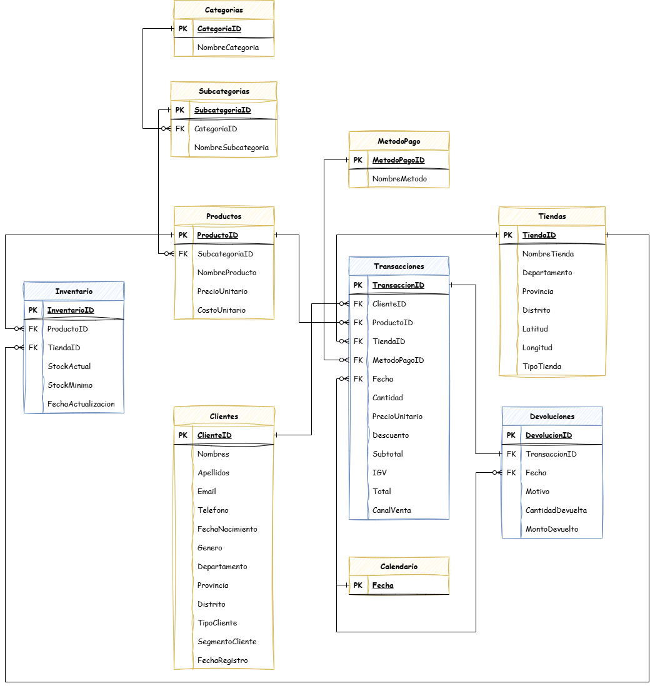
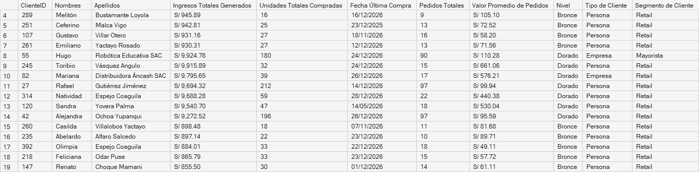
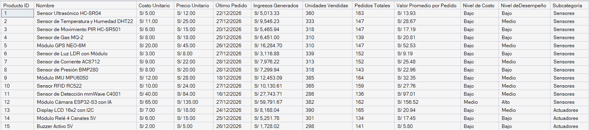
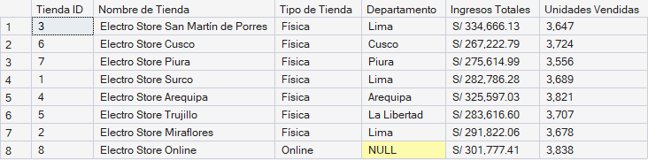

# Electrostore - Análisis de Datos con SQL

Realizo consultas a la base de datos relacional de Electro Store, una cadena ficticia de tiendas de electrónica y robótica, el cual tiene presencia en 5 ciudades del país y un canal de ventas online, con el objetivo de realizar un análisis de los datos y generar insights valiosos acerca del desempeño entre Enero 2024 y Diciembre 2026. Este es un proyecto de portafolio para mis prácticas preprofesionales en Análisis de Datos e Inteligencia Artificial.

# Objetivo

Generar insights valiosos para el negocio a través del análisis de datos y consultas a una base de datos utilizando SQL. Asimismo busco demostrar mi comodidad para trabajar con este lenguaje de consulta.

# Modelo de Datos

Mi modelo de datos sigue el esquema copo de nieve, en la cual podemos identificar 3 fact tables: `transacciones`, `devoluciones` e `inventario`, y 7 dimension tables: `clientes`, `productos`, `tiendas`, `categorias`, `subcategorias`, `metodoPago`, `calendario`.

# Reportes Finales

## Reporte de Clientes

## Reporte de Productos

## Reporte de Tiendas

# Funcionalidades Utilizadas

- Funciones de Agregación: Utilicé `SUM()`, `COUNT()`, `MIN()`, `MAX()`, `AVG()` para calcular valores como los ingresos totales, unidades vendidas, total de clientes y productos, cliente más joven y más adulto, valor promedio por pedido, etc.
- Funciones de Fecha y Tiempo: `EOMONTH()`, `YEAR()`, `DATEDIFF()` para analizar los ingresos mensuales y anuales, y calcular las edades de los clientes.
- Funciones de Formateo: Usé `FORMAT()` para darle el formato de la moneda peruana a los ingresos (mensuales, anuales y totales) y a las fechas (pasamos de yyyy-mm-dd a dd/mm/yyyy).
- Segmentación de Datos: Utilicé `CASE WHEN` para segmentar a los productos según su costo y a los clientes según el total de ingresos generados en compras para la empresa (bronce, plata y dorado).
- JOINS múltiples: Usé `LEFT JOIN` para combinar diferentes tablas, tales como Transacciones, Productos, Clientes, Subcategorías y Categorías, para así enriquecer los resultados y generar insights como las categorías de productos con mayores ingresos, los productos más vendidos, la tasa de devolución por categoría de producto, etc.
- Subconsultas: Usé subconsultas para calcular el total de ingresos por categoría, el total de productos por categoría y el total acumulado de ingresos.
- CTEs: Utilicé CTEs para crear consultas de múltiples pasos y crear los reportes finales de clientes y productos, así como para calcular los ingresos por categoría y segmentar a los productos según su costo.
- Funciones de Ventana: Usé `SUM() OVER()` para calcular los ingresos totales por categoría.
- Vistas: Creé vistas para almacenar los reportes finales de clientes, productos y tiendas.

# Hallazgos generados

- Los ingresos totales generados entre Enero 2024 y Diciembre 2026 fueron de S/ 2,363,103.
- De nuestro total de 400 clientes, el 88.5% (354) son personas naturales y solo el 11.5% (46) son empresas.
- La categoría de producto con mayores ingresos es la de Computación Embebida / SBC con un total de S/ 1,243,073.
- Mientras que la categoría con menores ingresos es la de Componentes Electrónicos con un total de S/ 66,715.
- El método de pago a través del cual se generaron mayores ingresos es Yape con S/ 689,987. Por otro lado, el método de pago con menores ingresos es la de Transferencia Bancaria con S/ 141,981.
- Más del 54% (217) de nuestros clientes, entre personas y empresas, se concentra en el departemento de Lima.
- La categoría con mayor tasa de devolución es la de Motores y Movimiento con 5.89% (87 devoluciones de las 1477 ventas realizadas).
- La categoría con menor tasa de devolución es la de Fuentes y Energía con 4.49% (81 devoluciones de las 1804 ventas.)
- La tienda con mayores ingresos fue la de San Martín de Porres con un total de S/ 334,666. Por otro lado, la tienda con menores ingresos fue la de Cusco con S/ 267,222.

## ¿Cómo usarlo?

1. Descargue y descomprima la carpeta `sql_scripts`.
2. Abra `master.sql`, actualice las rutas absolutas al inicio del archivo para que coincidan con la ubicación donde descomprimió la carpeta.
3. Ejecute `master.sql` en SQL Server Management Studio (SSMS) con SQLCMD Mode habilitado (Query → SQLCMD Mode) para crear y poblar la base de datos `electroStoreDB`.
4. Abra el archivo `Análisis Exploratorio de Datos.sql` y ejecute las diferentes consultas ya redactadas. Si desea ver los reportes finales de clientes, productos y tiendas, diríjase a la parte inferior de `Análisis Avanzado de Datos.sql` para crear las vistas. Del mismo modo, ejecute las consultas ya redactadas para ver los resultados.

## Autor

**Luis Tomás Dávila Naveda**
Estudiante de Ingeniería de Sistemas de Información — USIL

- Email: tonadavnav05@gmail.com
- LinkedIn: [linkedin.com/in/tomasdavilanaveda](https://www.linkedin.com/in/tomasdavilanaveda)

## Licencia

Este proyecto está bajo la licencia MIT.
